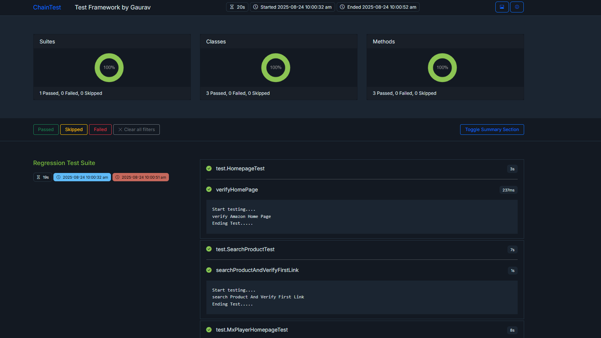

# Selenium TestNG Project with Allure Reporting

This is a demo project for Selenium Page Object Model with ChainTest reporting.

### Pre-requisites
* Java
* Maven
* IntelliJ IDEA
* Chain Test Jar [https://github.com/anshooarora/chaintest]

### Steps
1. Clone this project
2. Open the project in Intellij IDEA
3. Run TestNG.XML
4. Open the terminal in Intellij IDEA
5. Find results in target/chainTest/Index.html

### Report -

